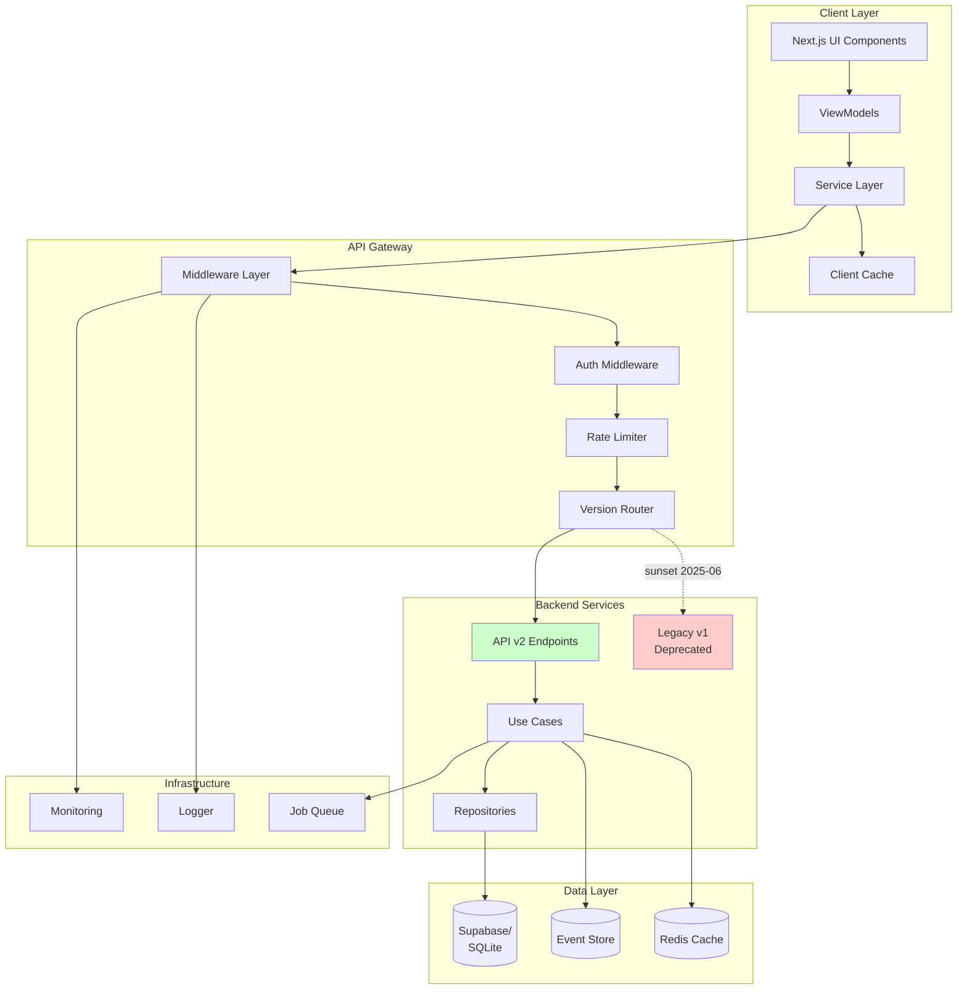
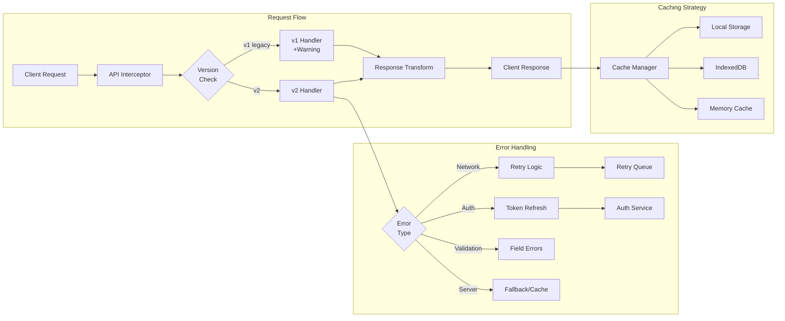
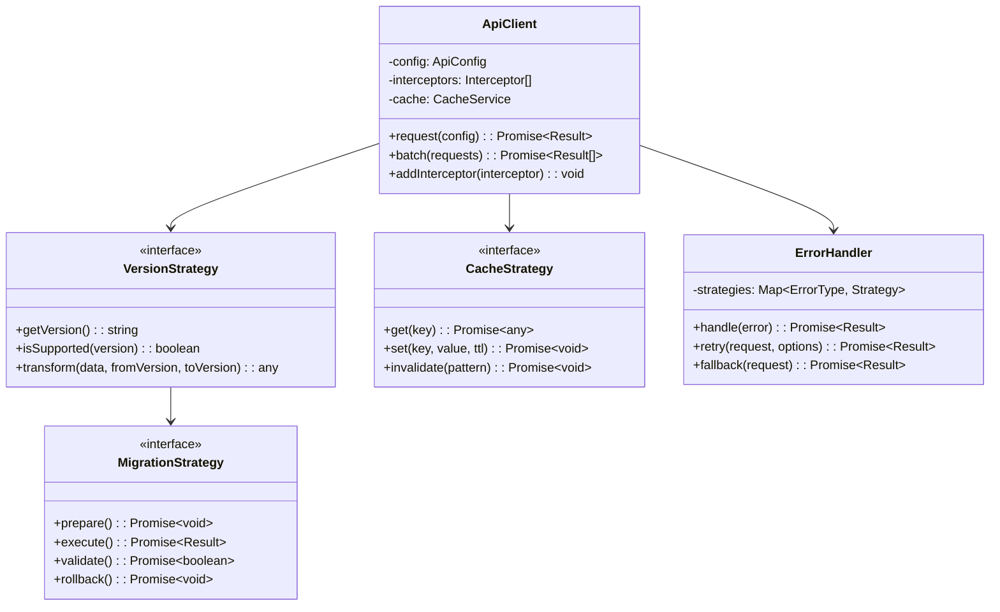
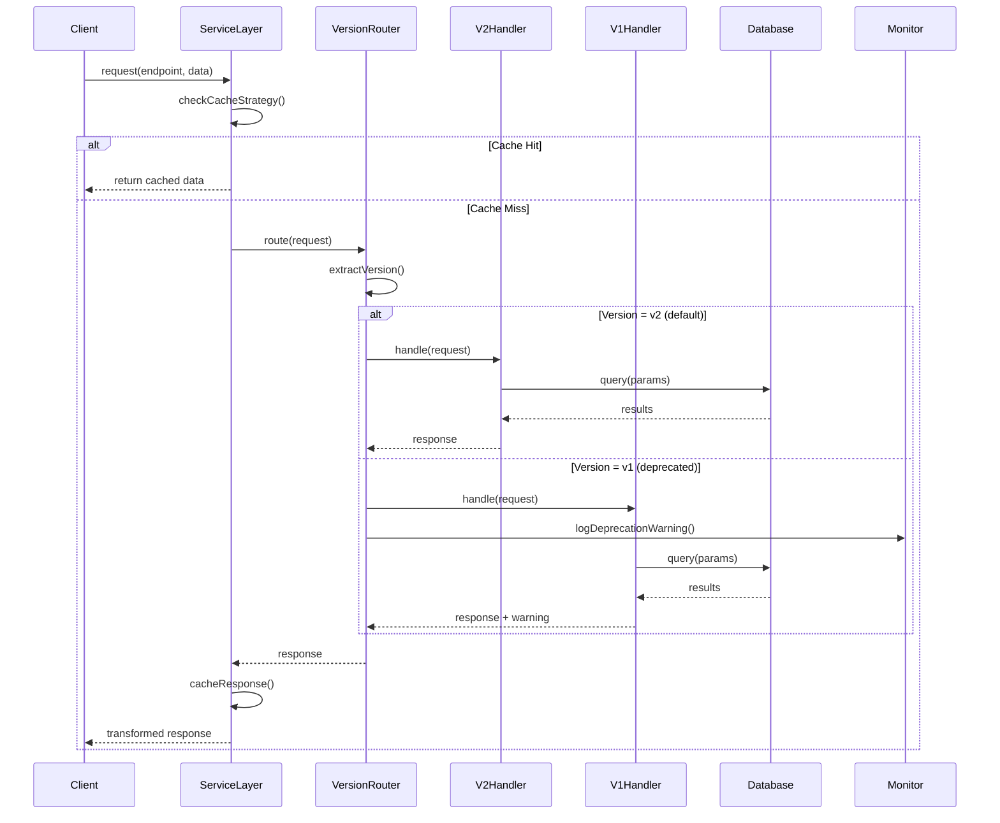
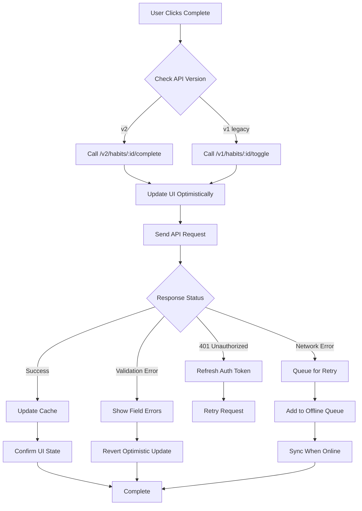
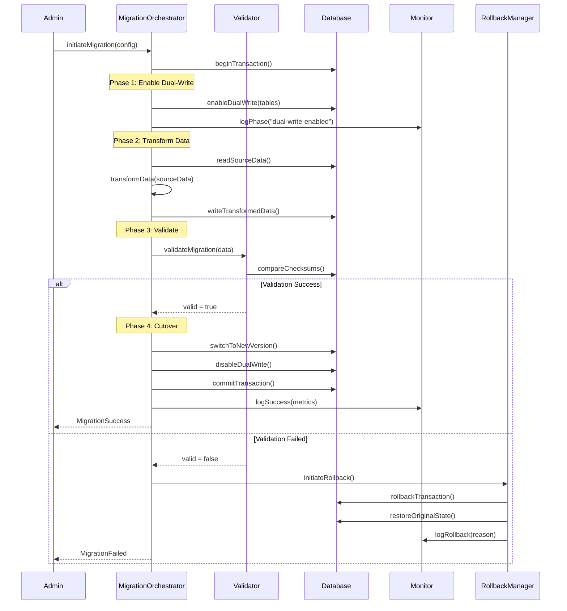
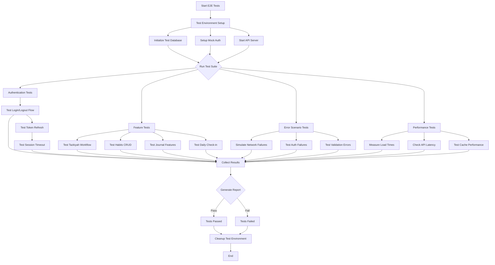

# Design Document - Frontend-Backend Alignment

## Overview

This design document outlines the technical architecture and implementation strategy for aligning the Sakinah application's frontend with the backend API v2 endpoints, followed by renaming v2 to v1 and deprecating the old v1 endpoints. The design focuses on establishing a robust, scalable, and maintainable system architecture while ensuring zero downtime and data integrity during the migration process.

### Design Goals and Scope

- **Primary Goal**: Achieve complete frontend-backend alignment with versioned API endpoints
- **Secondary Goals**:
  - Implement missing backend features for complete functionality
  - Establish comprehensive E2E testing infrastructure
  - Optimize performance and error handling
  - Ensure zero data loss during migration

## Architecture Design

### System Architecture Diagram



### Data Flow Diagram



## Component Design

### Frontend Service Layer

```typescript
// Service Layer Architecture
interface ServiceLayer {
  api: ApiService;
  cache: CacheService;
  auth: AuthService;
  sync: SyncService;
  error: ErrorService;
}

class ApiService {
  private interceptors: Interceptor[];
  private versionStrategy: VersionStrategy;

  async request<T>(config: RequestConfig): Promise<Result<T>>;
  addInterceptor(interceptor: Interceptor): void;
  setVersionStrategy(strategy: VersionStrategy): void;
}

class CacheService {
  private strategies: Map<CacheKey, CacheStrategy>;
  private storage: CacheStorage;

  async get<T>(key: string): Promise<T | null>;
  async set<T>(key: string, value: T, ttl?: number): Promise<void>;
  async invalidate(pattern: string): Promise<void>;
}
```

**Responsibilities:**
- Request/response transformation
- Version negotiation
- Cache management
- Error handling and recovery

**Interfaces:**
- `request()`: Unified API request interface
- `cache()`: Client-side caching operations
- `sync()`: Offline data synchronization

**Dependencies:**
- Next.js fetch API
- IndexedDB for offline storage
- Supabase client for auth

### Backend Version Router

```typescript
// Version Router Component
class VersionRouter {
  private routes: Map<string, VersionedRoute>;
  private migrationStrategies: Map<string, MigrationStrategy>;

  async route(request: Request): Promise<Response> {
    const version = this.extractVersion(request);
    const handler = this.getHandler(version, request.path);

    if (this.isDeprecated(version)) {
      response.headers.set('X-API-Deprecation', 'true');
      response.headers.set('X-API-Sunset', '2025-06-01');
    }

    return handler.execute(request);
  }

  private extractVersion(request: Request): string {
    return request.headers.get('X-API-Version') ||
           request.path.match(/\/v(\d+)/)?.[1] ||
           'v2'; // Default to v2
  }
}
```

**Responsibilities:**
- Version extraction from requests
- Route mapping to appropriate handlers
- Deprecation warnings
- Migration strategy execution

**Interfaces:**
- `route()`: Main routing logic
- `migrate()`: Data migration between versions
- `deprecate()`: Mark endpoints for sunset

**Dependencies:**
- Express.js router
- Migration service
- Monitoring service

### Migration Orchestrator

```typescript
// Migration Orchestrator
class MigrationOrchestrator {
  private strategies: Map<MigrationType, MigrationStrategy>;
  private validators: Map<DataType, Validator>;
  private rollbackManager: RollbackManager;

  async migrate(config: MigrationConfig): Promise<MigrationResult> {
    const transaction = await this.beginTransaction();

    try {
      // Phase 1: Dual-write mode
      await this.enableDualWrite(config);

      // Phase 2: Data transformation
      const transformed = await this.transformData(config);

      // Phase 3: Validation
      await this.validateMigration(transformed);

      // Phase 4: Cutover
      await this.performCutover(config);

      await transaction.commit();
      return { success: true, metrics: this.getMetrics() };
    } catch (error) {
      await this.rollbackManager.rollback(transaction);
      throw new MigrationError(error);
    }
  }
}
```

**Responsibilities:**
- Orchestrate migration phases
- Coordinate dual-write mode
- Manage rollback scenarios
- Track migration metrics

## Data Model

### Core Data Structure Definitions

```typescript
// API Version Configuration
interface ApiVersionConfig {
  version: 'v1' | 'v2';
  endpoints: Map<string, EndpointConfig>;
  transformers: Map<string, DataTransformer>;
  deprecated: boolean;
  sunsetDate?: Date;
}

// Request/Response Models
interface ApiRequest<T = any> {
  path: string;
  method: HttpMethod;
  headers: Headers;
  body?: T;
  query?: QueryParams;
  version?: string;
  correlationId: string;
}

interface ApiResponse<T = any> {
  data?: T;
  error?: ApiError;
  metadata: ResponseMetadata;
  warnings?: string[];
}

// Migration Models
interface MigrationPlan {
  id: string;
  source: VersionConfig;
  target: VersionConfig;
  strategy: MigrationStrategy;
  phases: MigrationPhase[];
  rollbackPlan: RollbackPlan;
  validations: ValidationRule[];
}

// Cache Models
interface CacheEntry<T> {
  key: string;
  value: T;
  ttl: number;
  createdAt: Date;
  version: string;
  tags: string[];
}
```

### Data Model Diagram



## Business Process

### Process 1: API Version Migration Flow



### Process 2: Habit Completion Flow (v1 to v2 Migration)



### Process 3: Data Migration and Rollback Process



### Process 4: End-to-End Test Execution Flow



## Error Handling Strategy

### Error Classification and Recovery

```typescript
// Error Types and Handlers
enum ErrorType {
  NETWORK = 'NETWORK',
  AUTH = 'AUTH',
  VALIDATION = 'VALIDATION',
  RATE_LIMIT = 'RATE_LIMIT',
  SERVER = 'SERVER',
  VERSION_MISMATCH = 'VERSION_MISMATCH'
}

class ErrorRecoveryStrategy {
  private strategies = new Map<ErrorType, RecoveryHandler>([
    [ErrorType.NETWORK, new NetworkErrorHandler()],
    [ErrorType.AUTH, new AuthErrorHandler()],
    [ErrorType.VALIDATION, new ValidationErrorHandler()],
    [ErrorType.RATE_LIMIT, new RateLimitHandler()],
    [ErrorType.SERVER, new ServerErrorHandler()],
    [ErrorType.VERSION_MISMATCH, new VersionMismatchHandler()]
  ]);

  async recover(error: ApiError): Promise<RecoveryResult> {
    const handler = this.strategies.get(error.type);
    if (!handler) {
      return { success: false, fallback: true };
    }

    return handler.handle(error);
  }
}

// Network Error Handler with Exponential Backoff
class NetworkErrorHandler implements RecoveryHandler {
  private retryAttempts = 0;
  private maxRetries = 3;

  async handle(error: NetworkError): Promise<RecoveryResult> {
    if (this.retryAttempts >= this.maxRetries) {
      return {
        success: false,
        action: 'QUEUE_OFFLINE',
        message: 'Request queued for offline sync'
      };
    }

    const delay = Math.pow(2, this.retryAttempts) * 1000;
    await this.sleep(delay);
    this.retryAttempts++;

    return {
      success: true,
      action: 'RETRY',
      retryAfter: delay
    };
  }
}
```

### Resilience Patterns

1. **Circuit Breaker Pattern**
   - Monitor failure rates per endpoint
   - Open circuit after threshold (5 failures in 1 minute)
   - Half-open state for testing recovery
   - Automatic recovery after cooldown period

2. **Bulkhead Pattern**
   - Isolate critical resources
   - Separate connection pools for different services
   - Prevent cascade failures

3. **Timeout and Retry Strategy**
   - Request timeout: 30 seconds
   - Exponential backoff: 1s, 2s, 4s
   - Max retries: 3 attempts
   - Jitter to prevent thundering herd

## Testing Infrastructure

### E2E Test Architecture

```typescript
// E2E Test Framework Configuration
interface E2ETestConfig {
  baseUrl: string;
  apiUrl: string;
  testDatabase: DatabaseConfig;
  mockAuth: AuthConfig;
  parallelism: number;
  timeout: number;
  retries: number;
}

// Page Object Model
class HabitsPage {
  private page: Page;

  async navigateToHabits(): Promise<void>;
  async createHabit(data: HabitData): Promise<void>;
  async toggleHabitCompletion(id: string): Promise<void>;
  async verifyHabitStreak(id: string, expected: number): Promise<void>;
  async deleteHabit(id: string): Promise<void>;
}

// Test Data Builders
class TestDataBuilder {
  static user(): UserBuilder;
  static habit(): HabitBuilder;
  static plan(): PlanBuilder;
  static journal(): JournalBuilder;
}

// Test Utilities
class TestUtils {
  static async seedDatabase(data: SeedData): Promise<void>;
  static async cleanupDatabase(): Promise<void>;
  static async mockApiResponse(endpoint: string, response: any): Promise<void>;
  static async waitForApiCall(endpoint: string): Promise<void>;
}
```

### Test Coverage Strategy

1. **Unit Tests** (Target: 90% coverage)
   - Service layer methods
   - Data transformers
   - Validation logic
   - Error handlers

2. **Integration Tests** (Target: 85% coverage)
   - API endpoint testing
   - Database operations
   - Cache operations
   - Authentication flows

3. **E2E Tests** (Target: 80% coverage)
   - Critical user journeys
   - Cross-browser testing
   - Mobile responsive testing
   - Offline scenarios

## Performance Optimization Techniques

### Client-Side Optimization

1. **Request Batching**
```typescript
class RequestBatcher {
  private queue: Map<string, Request[]> = new Map();
  private batchWindow = 50; // ms

  async add(request: Request): Promise<Response> {
    return new Promise((resolve) => {
      this.queue.get(request.endpoint)?.push(request) ||
      this.queue.set(request.endpoint, [request]);

      setTimeout(() => this.flush(request.endpoint, resolve), this.batchWindow);
    });
  }

  private async flush(endpoint: string, resolve: Function) {
    const batch = this.queue.get(endpoint);
    if (!batch) return;

    const response = await this.sendBatch(batch);
    resolve(response);
    this.queue.delete(endpoint);
  }
}
```

2. **Intelligent Caching**
   - Memory cache for frequently accessed data
   - IndexedDB for offline support
   - Service Worker for asset caching
   - Cache invalidation strategies

3. **Lazy Loading and Code Splitting**
   - Dynamic imports for route components
   - Intersection Observer for content loading
   - Virtual scrolling for large lists

### Server-Side Optimization

1. **Database Query Optimization**
   - Index optimization for common queries
   - Query result caching with Redis
   - Connection pooling
   - Read replicas for heavy read operations

2. **Response Compression**
   - Gzip/Brotli compression
   - Field filtering in API responses
   - Pagination with cursor-based navigation

3. **Resource Optimization**
   - CDN for static assets
   - Image optimization and WebP format
   - Edge caching for API responses

## Monitoring and Observability Setup

### Metrics Collection

```typescript
// Metrics Collector
class MetricsCollector {
  private metrics: Map<string, Metric> = new Map();

  recordApiCall(endpoint: string, duration: number, status: number) {
    this.metrics.get('api_calls')?.increment({
      endpoint,
      status,
      duration_bucket: this.getDurationBucket(duration)
    });
  }

  recordError(type: ErrorType, context: any) {
    this.metrics.get('errors')?.increment({
      type,
      endpoint: context.endpoint,
      user_id: this.hashUserId(context.userId)
    });
  }

  recordCacheHit(key: string, hit: boolean) {
    this.metrics.get('cache')?.increment({
      hit: hit.toString(),
      cache_key_pattern: this.getKeyPattern(key)
    });
  }
}
```

### Distributed Tracing

```typescript
// Correlation ID Middleware
class CorrelationMiddleware {
  handle(req: Request, res: Response, next: NextFunction) {
    const correlationId = req.headers['x-correlation-id'] ||
                          this.generateCorrelationId();

    req.correlationId = correlationId;
    res.setHeader('x-correlation-id', correlationId);

    // Propagate to downstream services
    this.propagateContext({
      correlationId,
      userId: req.user?.id,
      sessionId: req.session?.id,
      timestamp: Date.now()
    });

    next();
  }
}
```

### Health Checks and Alerts

```typescript
// Health Check Implementation
class HealthCheckService {
  async checkHealth(): Promise<HealthStatus> {
    const checks = await Promise.allSettled([
      this.checkDatabase(),
      this.checkCache(),
      this.checkExternalServices(),
      this.checkDiskSpace(),
      this.checkMemoryUsage()
    ]);

    return {
      status: this.aggregateStatus(checks),
      checks: this.formatChecks(checks),
      timestamp: new Date().toISOString(),
      version: process.env.API_VERSION
    };
  }

  private async checkDatabase(): Promise<ComponentHealth> {
    try {
      await db.query('SELECT 1');
      return { name: 'database', status: 'healthy', responseTime: Date.now() - start };
    } catch (error) {
      return { name: 'database', status: 'unhealthy', error: error.message };
    }
  }
}
```

### Alert Configuration

1. **Critical Alerts** (Immediate notification)
   - API endpoint down > 1 minute
   - Database connection failure
   - Auth service unavailable
   - Error rate > 5%

2. **Warning Alerts** (15-minute aggregation)
   - Response time P95 > 1 second
   - Memory usage > 80%
   - Deprecated API usage spike
   - Cache hit rate < 60%

3. **Info Alerts** (Daily summary)
   - Daily active users
   - Feature usage statistics
   - Migration progress metrics
   - Performance trends

## Security Considerations

### API Security

1. **Authentication & Authorization**
   - JWT token validation on every request
   - Token refresh mechanism
   - Role-based access control (RBAC)
   - Session timeout after 30 minutes of inactivity

2. **Rate Limiting**
   - Per-user rate limiting: 100 requests/minute
   - Per-IP rate limiting: 1000 requests/minute
   - Endpoint-specific limits for sensitive operations

3. **Input Validation**
   - Zod schema validation for all inputs
   - SQL injection prevention
   - XSS protection with content sanitization

### Data Security

1. **Encryption**
   - TLS 1.3 for all API communications
   - Encryption at rest for sensitive data
   - Field-level encryption for PII

2. **Privacy Compliance**
   - GDPR compliance with data minimization
   - User consent management
   - Data retention policies
   - Right to erasure implementation

## Deployment Strategy

### Phased Rollout Plan

1. **Phase 1: Development Environment** (Week 1-2)
   - Deploy v2 endpoints alongside v1
   - Enable feature flags for gradual migration
   - Comprehensive testing of all endpoints

2. **Phase 2: Staging Environment** (Week 3-4)
   - Full E2E testing with production-like data
   - Performance testing and optimization
   - Security audit and penetration testing

3. **Phase 3: Production Canary** (Week 5)
   - Deploy to 5% of users
   - Monitor metrics and error rates
   - Collect user feedback

4. **Phase 4: Production Rollout** (Week 6)
   - Gradual increase to 100% of users
   - Monitor all metrics closely
   - Ready rollback plan if needed

5. **Phase 5: Cleanup** (Week 7-8)
   - Rename v2 to v1
   - Remove old v1 code
   - Update documentation
   - Archive deprecated code

### Rollback Strategy

```typescript
// Rollback Manager
class RollbackManager {
  async initiateRollback(reason: string): Promise<RollbackResult> {
    // Step 1: Stop incoming traffic to new version
    await this.loadBalancer.routeToOldVersion();

    // Step 2: Drain existing connections
    await this.connectionPool.drain();

    // Step 3: Restore database state if needed
    if (this.requiresDatabaseRollback()) {
      await this.database.restoreFromBackup(this.lastKnownGoodBackup);
    }

    // Step 4: Clear caches
    await this.cache.flush();

    // Step 5: Notify monitoring
    await this.monitor.alert('ROLLBACK_INITIATED', { reason });

    return { success: true, rollbackTimestamp: Date.now() };
  }
}
```

## Summary

This design document provides a comprehensive technical blueprint for the frontend-backend alignment project. The architecture emphasizes:

1. **Gradual Migration**: Smooth transition from v1 to v2 with minimal disruption
2. **Robust Error Handling**: Multiple recovery strategies and fallback mechanisms
3. **Performance Optimization**: Client and server-side optimizations for optimal UX
4. **Comprehensive Testing**: Multi-layer testing strategy ensuring reliability
5. **Monitoring and Observability**: Complete visibility into system behavior
6. **Security First**: Multiple layers of security controls
7. **Zero Downtime Deployment**: Phased rollout with instant rollback capability

The implementation should follow the processes and patterns outlined in this document to ensure a successful migration that maintains data integrity, system reliability, and user satisfaction throughout the transition period.