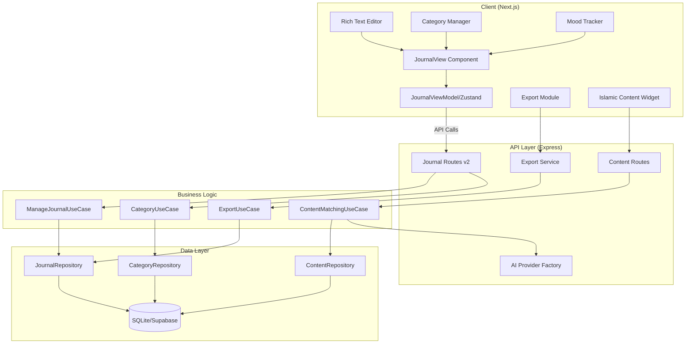
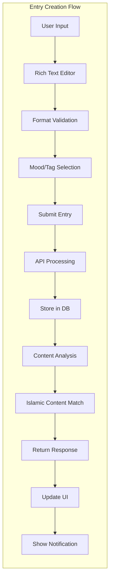
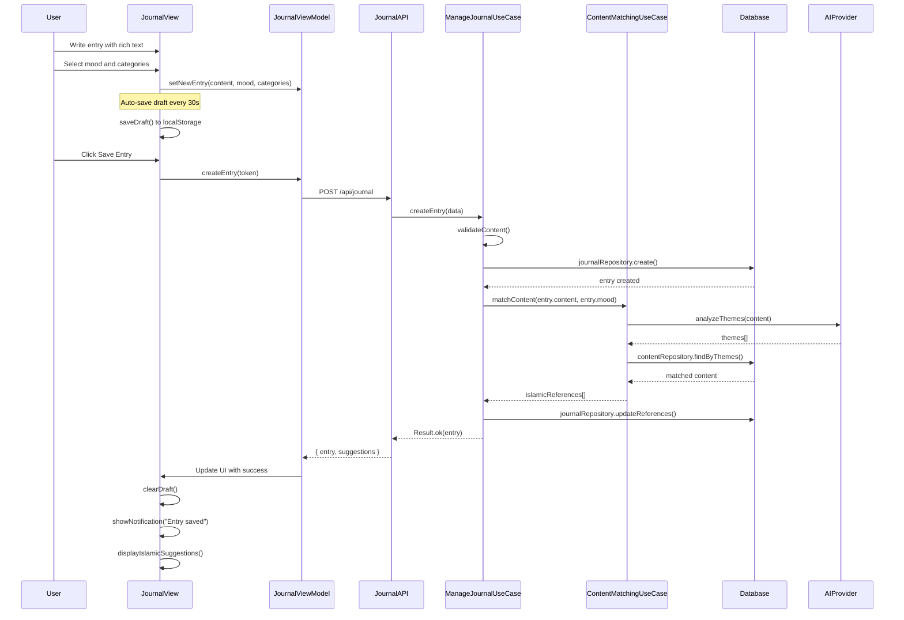
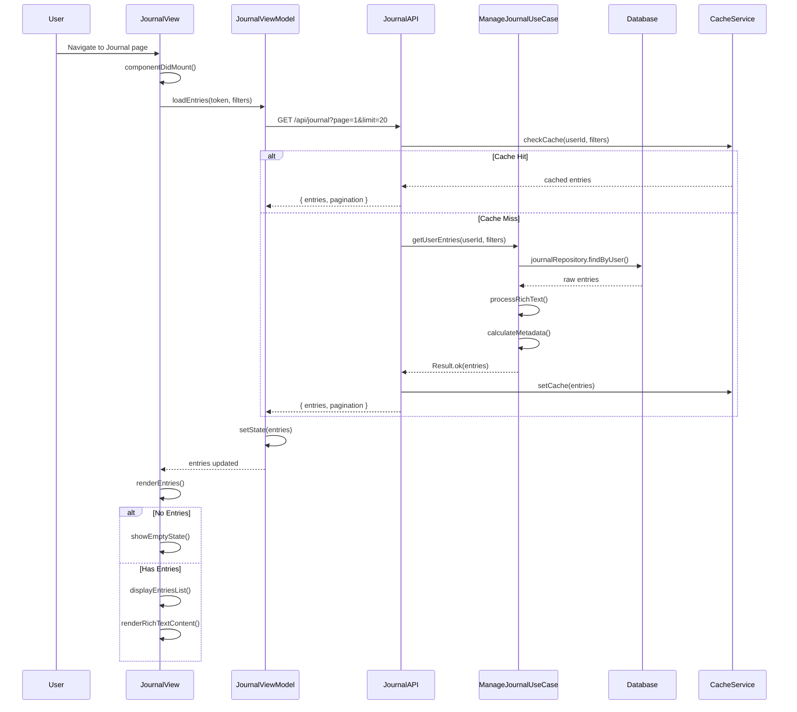
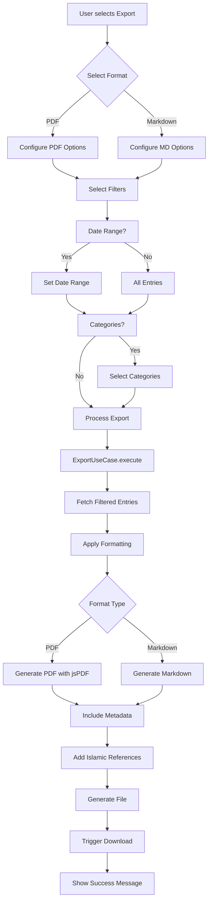
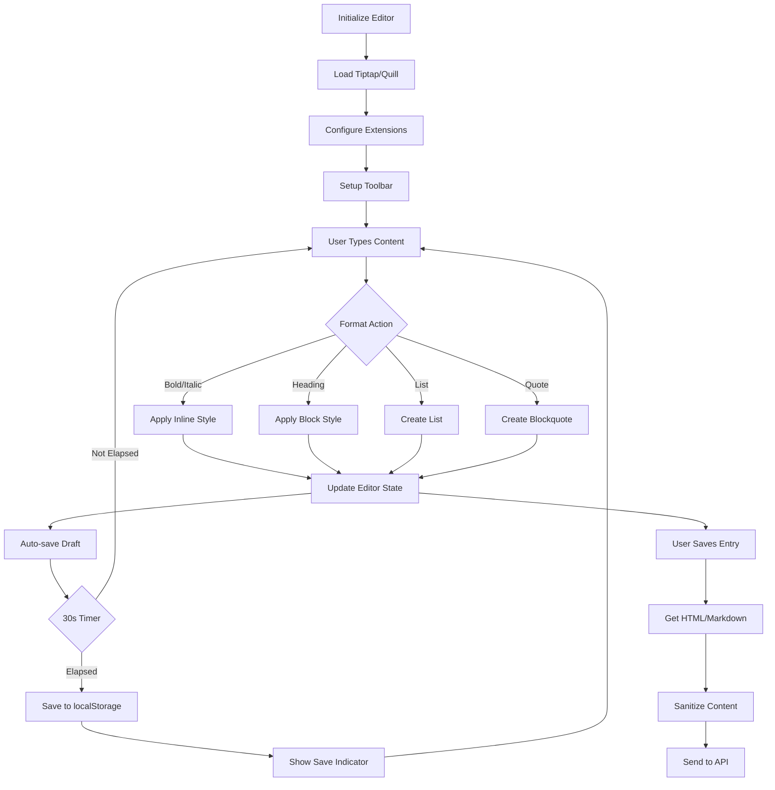

# Journal Improvements Design Document

## Overview

This design document outlines the technical implementation for comprehensive journal improvements in the Sakinah application. The design addresses critical bug fixes for entry display functionality and implements advanced features including rich text editing, categorization, export functionality, mood tracking, and Islamic content integration. The solution maintains backward compatibility while providing a scalable foundation for future enhancements.

## Architecture Design

### System Architecture Diagram



### Data Flow Diagram



## Component Design

### Frontend Components

#### JournalView Component (Enhanced)
- **Responsibilities:**
  - Main journal interface container
  - Entry display with proper data fetching
  - Form management with validation
  - Notification handling
- **Interfaces:**
  ```typescript
  interface JournalViewProps {
    locale: string;
    userId: string;
  }
  ```
- **Dependencies:**
  - JournalViewModel
  - RichTextEditor
  - CategorySelector
  - MoodSelector
  - ExportManager
  - IslamicContentWidget

#### RichTextEditor Component
- **Responsibilities:**
  - Rich text editing capabilities
  - Format toolbar management
  - Plain text toggle
  - Auto-save functionality
- **Interfaces:**
  ```typescript
  interface RichTextEditorProps {
    value: string;
    onChange: (value: string, isRichText: boolean) => void;
    placeholder: string;
    autoSave: boolean;
    onAutoSave?: () => void;
  }
  ```
- **Dependencies:**
  - Tiptap or Quill.js library
  - DOMPurify for sanitization

#### CategoryManager Component
- **Responsibilities:**
  - Category CRUD operations
  - Category assignment to entries
  - Category filtering
- **Interfaces:**
  ```typescript
  interface CategoryManagerProps {
    selectedCategories: string[];
    onCategoryChange: (categories: string[]) => void;
    userId: string;
  }
  ```

#### MoodTracker Component
- **Responsibilities:**
  - Mood selection interface
  - Spiritual state tracking
  - Analytics visualization
- **Interfaces:**
  ```typescript
  interface MoodTrackerProps {
    mood?: MoodType;
    spiritualState?: SpiritualStateType;
    onChange: (mood: MoodType, state: SpiritualStateType) => void;
  }
  ```

### Backend Components

#### Enhanced ManageJournalUseCase
- **Responsibilities:**
  - Entry CRUD operations with proper error handling
  - Rich text processing and validation
  - Category management
  - Content analysis triggering
- **Interfaces:**
  ```typescript
  interface ManageJournalUseCase {
    getUserEntries(userId: string, filters: JournalFilters): Promise<Result<JournalEntry[]>>
    createEntry(data: CreateEntryDTO): Promise<Result<JournalEntry>>
    updateEntry(id: string, data: UpdateEntryDTO): Promise<Result<JournalEntry>>
    deleteEntry(id: string, userId: string): Promise<Result<boolean>>
    exportEntries(userId: string, format: ExportFormat, filters: ExportFilters): Promise<Result<Buffer>>
  }
  ```

#### ContentMatchingUseCase
- **Responsibilities:**
  - Analyze journal content for keywords
  - Match Islamic content based on themes
  - Use AI provider for semantic matching
- **Interfaces:**
  ```typescript
  interface ContentMatchingUseCase {
    matchContent(text: string, mood?: MoodType): Promise<Result<IslamicContent[]>>
    analyzeThemes(text: string): Promise<Result<string[]>>
  }
  ```

#### ExportUseCase
- **Responsibilities:**
  - Generate PDF exports
  - Generate Markdown exports
  - Apply filters and formatting
- **Interfaces:**
  ```typescript
  interface ExportUseCase {
    exportToPDF(entries: JournalEntry[], options: ExportOptions): Promise<Buffer>
    exportToMarkdown(entries: JournalEntry[], options: ExportOptions): Promise<string>
  }
  ```

## Data Model

### Core Data Structure Definitions

```typescript
// Enhanced Journal Entry Model
interface JournalEntry {
  id: string;
  userId: string;
  title?: string;
  content: string;
  contentFormat: 'plain' | 'rich';
  tags: string[];
  categories: string[];
  mood?: MoodType;
  spiritualState?: SpiritualStateType;
  islamicReferences?: IslamicReference[];
  metadata: {
    wordCount: number;
    readingTime: number;
    lastModified?: Date;
  };
  createdAt: Date;
  updatedAt: Date;
}

// Category Model
interface Category {
  id: string;
  userId: string;
  name: string;
  color: string;
  icon?: string;
  entryCount: number;
  createdAt: Date;
  updatedAt: Date;
}

// Mood and Spiritual State Types
type MoodType = 'grateful' | 'anxious' | 'peaceful' | 'struggling' | 'hopeful' | 'sad' | 'content';
type SpiritualStateType = 'close' | 'distant' | 'seeking' | 'content' | 'struggling';

// Islamic Reference Model
interface IslamicReference {
  type: 'quran' | 'hadith' | 'dua';
  text: string;
  reference: string;
  relevanceScore: number;
}

// Export Options
interface ExportOptions {
  format: 'pdf' | 'markdown';
  dateRange?: { from: Date; to: Date };
  categories?: string[];
  includeMetadata: boolean;
  includeIslamicReferences: boolean;
}
```

### Database Schema Changes

```sql
-- Alter existing journals table
ALTER TABLE journals ADD COLUMN title TEXT;
ALTER TABLE journals ADD COLUMN content_format TEXT DEFAULT 'plain' CHECK (content_format IN ('plain', 'rich'));
ALTER TABLE journals ADD COLUMN categories TEXT DEFAULT '[]'; -- JSON array
ALTER TABLE journals ADD COLUMN mood TEXT CHECK (mood IN ('grateful', 'anxious', 'peaceful', 'struggling', 'hopeful', 'sad', 'content'));
ALTER TABLE journals ADD COLUMN spiritual_state TEXT CHECK (spiritual_state IN ('close', 'distant', 'seeking', 'content', 'struggling'));
ALTER TABLE journals ADD COLUMN islamic_references TEXT DEFAULT '[]'; -- JSON array
ALTER TABLE journals ADD COLUMN metadata TEXT DEFAULT '{}'; -- JSON object
ALTER TABLE journals ADD COLUMN updated_at TEXT NOT NULL DEFAULT (datetime('now'));

-- New categories table
CREATE TABLE IF NOT EXISTS journal_categories (
  id TEXT PRIMARY KEY DEFAULT (lower(hex(randomblob(16)))),
  user_id TEXT REFERENCES users(id) ON DELETE CASCADE NOT NULL,
  name TEXT NOT NULL,
  color TEXT DEFAULT '#10b981',
  icon TEXT,
  entry_count INTEGER DEFAULT 0,
  created_at TEXT NOT NULL DEFAULT (datetime('now')),
  updated_at TEXT NOT NULL DEFAULT (datetime('now')),
  UNIQUE(user_id, name)
);

-- Journal mood analytics table
CREATE TABLE IF NOT EXISTS journal_mood_analytics (
  id TEXT PRIMARY KEY DEFAULT (lower(hex(randomblob(16)))),
  user_id TEXT REFERENCES users(id) ON DELETE CASCADE NOT NULL,
  date TEXT NOT NULL, -- ISO date string
  mood_counts TEXT NOT NULL, -- JSON object with mood type counts
  spiritual_state_counts TEXT NOT NULL, -- JSON object with state counts
  total_entries INTEGER DEFAULT 0,
  created_at TEXT NOT NULL DEFAULT (datetime('now')),
  UNIQUE(user_id, date)
);

-- Add indexes for performance
CREATE INDEX IF NOT EXISTS idx_journals_title ON journals(title);
CREATE INDEX IF NOT EXISTS idx_journals_mood ON journals(mood);
CREATE INDEX IF NOT EXISTS idx_journals_spiritual_state ON journals(spiritual_state);
CREATE INDEX IF NOT EXISTS idx_journals_updated_at ON journals(updated_at);
CREATE INDEX IF NOT EXISTS idx_journal_categories_user ON journal_categories(user_id);
CREATE INDEX IF NOT EXISTS idx_journal_mood_analytics_user_date ON journal_mood_analytics(user_id, date);

-- Full-text search support (for SQLite FTS5)
CREATE VIRTUAL TABLE IF NOT EXISTS journals_fts USING fts5(
  content,
  title,
  tags,
  content=journals,
  content_rowid=rowid
);

-- Trigger to keep FTS index updated
CREATE TRIGGER IF NOT EXISTS journals_fts_insert AFTER INSERT ON journals
BEGIN
  INSERT INTO journals_fts(rowid, content, title, tags)
  VALUES (new.rowid, new.content, new.title, new.tags);
END;

CREATE TRIGGER IF NOT EXISTS journals_fts_update AFTER UPDATE ON journals
BEGIN
  UPDATE journals_fts
  SET content = new.content, title = new.title, tags = new.tags
  WHERE rowid = new.rowid;
END;

CREATE TRIGGER IF NOT EXISTS journals_fts_delete AFTER DELETE ON journals
BEGIN
  DELETE FROM journals_fts WHERE rowid = old.rowid;
END;
```

## Business Process

### Process 1: Entry Creation with Islamic Content Suggestion



### Process 2: Entry Retrieval and Display Fix



### Process 3: Export Process



### Process 4: Rich Text Editor Integration



## Error Handling Strategy

### Frontend Error Handling

```typescript
// Enhanced error handling in JournalViewModel
class JournalErrorHandler {
  handleError(error: Error, context: string): ErrorResponse {
    // Network errors
    if (error.message.includes('fetch')) {
      return {
        type: 'network',
        message: 'Connection error. Your entry has been saved locally and will sync when online.',
        action: 'retry',
        showOfflineIndicator: true
      };
    }

    // Validation errors
    if (error.message.includes('validation')) {
      return {
        type: 'validation',
        message: 'Please check your entry for required fields.',
        action: 'fix',
        fields: this.extractValidationFields(error)
      };
    }

    // Server errors
    if (error.message.includes('500')) {
      return {
        type: 'server',
        message: 'Something went wrong. We\'ve been notified and are working on it.',
        action: 'retry',
        allowReport: true
      };
    }

    // Default
    return {
      type: 'unknown',
      message: 'An unexpected error occurred.',
      action: 'retry'
    };
  }

  async retryWithBackoff(fn: Function, maxRetries = 3): Promise<any> {
    let delay = 1000;
    for (let i = 0; i < maxRetries; i++) {
      try {
        return await fn();
      } catch (error) {
        if (i === maxRetries - 1) throw error;
        await new Promise(resolve => setTimeout(resolve, delay));
        delay *= 2;
      }
    }
  }
}
```

### Backend Error Handling

```typescript
// Comprehensive error handling in use cases
class JournalErrorWrapper {
  async execute<T>(operation: () => Promise<T>): Promise<Result<T>> {
    try {
      const result = await operation();
      return Result.ok(result);
    } catch (error) {
      // Database errors
      if (error.code === 'SQLITE_CONSTRAINT') {
        return Result.err(new ValidationError('Duplicate entry or constraint violation'));
      }

      // Permission errors
      if (error.code === 'FORBIDDEN') {
        return Result.err(new PermissionError('You don\'t have permission to perform this action'));
      }

      // Not found errors
      if (error.code === 'NOT_FOUND') {
        return Result.err(new NotFoundError('The requested journal entry was not found'));
      }

      // Log and return generic error
      logger.error('Journal operation failed', { error, operation: operation.name });
      return Result.err(new InternalError('An error occurred while processing your request'));
    }
  }
}
```

### Notification System

```typescript
// Notification service for user feedback
class NotificationService {
  private queue: Notification[] = [];
  private showing: boolean = false;

  show(notification: Notification): void {
    this.queue.push(notification);
    if (!this.showing) {
      this.processQueue();
    }
  }

  private async processQueue(): Promise<void> {
    if (this.queue.length === 0) {
      this.showing = false;
      return;
    }

    this.showing = true;
    const notification = this.queue.shift()!;

    // Show notification
    await this.display(notification);

    // Auto-dismiss after duration
    setTimeout(() => {
      this.dismiss();
      this.processQueue();
    }, notification.duration || 5000);
  }

  private display(notification: Notification): void {
    // Implementation for toast/banner display
    const element = this.createElement(notification);
    document.body.appendChild(element);
    requestAnimationFrame(() => {
      element.classList.add('show');
    });
  }
}
```

## API Endpoint Design

### Modified Existing Endpoints

```typescript
// GET /api/journal
// Enhanced with new query parameters
interface GetJournalParams {
  page?: number;
  limit?: number;
  search?: string;
  tags?: string;
  categories?: string[];  // NEW
  mood?: MoodType;        // NEW
  fromDate?: string;      // NEW
  toDate?: string;        // NEW
  sortBy?: 'createdAt' | 'updatedAt' | 'title';  // ENHANCED
  sortOrder?: 'asc' | 'desc';
  includeReferences?: boolean;  // NEW
}

// POST /api/journal
// Enhanced request body
interface CreateJournalBody {
  title?: string;         // NEW
  content: string;
  contentFormat?: 'plain' | 'rich';  // NEW
  tags?: string[];
  categories?: string[];  // NEW
  mood?: MoodType;        // NEW
  spiritualState?: SpiritualStateType;  // NEW
}

// PUT /api/journal/:id
// Enhanced update capabilities
interface UpdateJournalBody extends CreateJournalBody {
  // All fields optional for partial updates
}
```

### New Endpoints

```typescript
// GET /api/journal/export
// Export entries in various formats
router.get('/export', authMiddleware, async (req: AuthRequest, res) => {
  const { format, ...filters } = req.query;
  const useCase = container.resolve(ExportUseCase);
  const result = await useCase.exportEntries(req.userId!, format as ExportFormat, filters);

  if (result.ok) {
    res.setHeader('Content-Type', format === 'pdf' ? 'application/pdf' : 'text/markdown');
    res.setHeader('Content-Disposition', `attachment; filename="journal-export.${format}"`);
    res.send(result.value);
  } else {
    res.status(400).json({ error: result.error });
  }
});

// GET /api/journal/suggestions/:id
// Get Islamic content suggestions for an entry
router.get('/suggestions/:id', authMiddleware, async (req: AuthRequest, res) => {
  const useCase = container.resolve(ContentMatchingUseCase);
  const entry = await journalRepository.findById(req.params.id);

  if (!entry || entry.userId !== req.userId) {
    return res.status(404).json({ error: 'Entry not found' });
  }

  const result = await useCase.matchContent(entry.content, entry.mood);
  res.json({ suggestions: result.value });
});

// Categories endpoints
// GET /api/journal/categories
router.get('/categories', authMiddleware, async (req: AuthRequest, res) => {
  const categories = await categoryRepository.findByUser(req.userId!);
  res.json({ categories });
});

// POST /api/journal/categories
router.post('/categories', authMiddleware, async (req: AuthRequest, res) => {
  const result = await categoryUseCase.createCategory(req.userId!, req.body);
  res.json({ category: result.value });
});

// PUT /api/journal/categories/:id
router.put('/categories/:id', authMiddleware, async (req: AuthRequest, res) => {
  const result = await categoryUseCase.updateCategory(req.params.id, req.userId!, req.body);
  res.json({ category: result.value });
});

// DELETE /api/journal/categories/:id
router.delete('/categories/:id', authMiddleware, async (req: AuthRequest, res) => {
  await categoryUseCase.deleteCategory(req.params.id, req.userId!);
  res.json({ success: true });
});

// GET /api/journal/analytics
// Get mood and spiritual state analytics
router.get('/analytics', authMiddleware, async (req: AuthRequest, res) => {
  const { period = '30d' } = req.query;
  const analytics = await analyticsUseCase.getMoodAnalytics(req.userId!, period as string);
  res.json({ analytics });
});
```

## Performance Optimization Strategies

### Frontend Optimizations

1. **Virtual Scrolling for Large Entry Lists**
```typescript
// Use react-window for virtualization
import { FixedSizeList } from 'react-window';

const EntryList = ({ entries }) => (
  <FixedSizeList
    height={600}
    itemCount={entries.length}
    itemSize={150}
    width="100%"
  >
    {({ index, style }) => (
      <div style={style}>
        <EntryCard entry={entries[index]} />
      </div>
    )}
  </FixedSizeList>
);
```

2. **Debounced Search with Caching**
```typescript
const useDebounceSearch = (searchFn: Function, delay: number = 300) => {
  const cache = useRef(new Map());
  const timeoutRef = useRef<NodeJS.Timeout>();

  return useCallback((query: string) => {
    clearTimeout(timeoutRef.current);

    // Check cache first
    if (cache.current.has(query)) {
      return Promise.resolve(cache.current.get(query));
    }

    return new Promise((resolve) => {
      timeoutRef.current = setTimeout(async () => {
        const result = await searchFn(query);
        cache.current.set(query, result);
        resolve(result);
      }, delay);
    });
  }, [searchFn, delay]);
};
```

3. **Lazy Loading of Rich Text Editor**
```typescript
const RichTextEditor = lazy(() => import('./RichTextEditor'));

const JournalForm = () => {
  const [showRichEditor, setShowRichEditor] = useState(false);

  return (
    <Suspense fallback={<div>Loading editor...</div>}>
      {showRichEditor ? (
        <RichTextEditor />
      ) : (
        <textarea onClick={() => setShowRichEditor(true)} />
      )}
    </Suspense>
  );
};
```

### Backend Optimizations

1. **Database Query Optimization**
```typescript
// Optimized repository with proper indexing
class OptimizedJournalRepository {
  async findByUserWithPagination(
    userId: string,
    filters: JournalFilters,
    page: number,
    limit: number
  ): Promise<[JournalEntry[], number]> {
    // Use FTS5 for full-text search
    if (filters.search) {
      const query = `
        SELECT j.*, highlight(journals_fts, 0, '<mark>', '</mark>') as highlighted_content
        FROM journals j
        JOIN journals_fts ON j.rowid = journals_fts.rowid
        WHERE journals_fts MATCH ? AND j.user_id = ?
        ORDER BY rank
        LIMIT ? OFFSET ?
      `;
      // Execute with proper parameter binding
    }

    // Regular query with optimized indexes
    const query = `
      SELECT * FROM journals
      WHERE user_id = ?
        ${filters.categories ? 'AND categories LIKE ?' : ''}
        ${filters.mood ? 'AND mood = ?' : ''}
        ${filters.fromDate ? 'AND created_at >= ?' : ''}
        ${filters.toDate ? 'AND created_at <= ?' : ''}
      ORDER BY ${filters.sortBy} ${filters.sortOrder}
      LIMIT ? OFFSET ?
    `;

    // Count query for pagination
    const countQuery = `SELECT COUNT(*) FROM journals WHERE user_id = ? ${/* same filters */}`;

    const [entries, total] = await Promise.all([
      this.db.all(query, params),
      this.db.get(countQuery, countParams)
    ]);

    return [entries, total.count];
  }
}
```

2. **Response Caching**
```typescript
// Redis-based caching for frequently accessed data
class JournalCacheService {
  private redis: RedisClient;
  private ttl = 300; // 5 minutes

  async getCached(key: string): Promise<any | null> {
    const cached = await this.redis.get(key);
    return cached ? JSON.parse(cached) : null;
  }

  async setCached(key: string, value: any): Promise<void> {
    await this.redis.setex(key, this.ttl, JSON.stringify(value));
  }

  async invalidateUser(userId: string): Promise<void> {
    const keys = await this.redis.keys(`journal:${userId}:*`);
    if (keys.length > 0) {
      await this.redis.del(...keys);
    }
  }
}
```

3. **Batch Processing for Islamic Content Matching**
```typescript
class BatchContentMatcher {
  private queue: Map<string, Promise<IslamicContent[]>> = new Map();
  private batchTimer: NodeJS.Timeout | null = null;

  async matchContent(text: string, mood?: MoodType): Promise<IslamicContent[]> {
    const key = `${text.substring(0, 100)}:${mood}`;

    if (this.queue.has(key)) {
      return this.queue.get(key)!;
    }

    const promise = new Promise<IslamicContent[]>((resolve) => {
      this.addToBatch(key, { text, mood, resolve });
    });

    this.queue.set(key, promise);
    return promise;
  }

  private addToBatch(key: string, request: BatchRequest): void {
    // Collect requests and process in batch
    if (!this.batchTimer) {
      this.batchTimer = setTimeout(() => this.processBatch(), 50);
    }
  }
}
```

## Security Considerations

### Input Validation and Sanitization

```typescript
// Rich text content sanitization
import DOMPurify from 'isomorphic-dompurify';

class ContentSanitizer {
  private config = {
    ALLOWED_TAGS: ['p', 'br', 'strong', 'em', 'u', 's', 'h1', 'h2', 'h3', 'blockquote', 'ul', 'ol', 'li'],
    ALLOWED_ATTR: ['class'],
    ALLOW_DATA_ATTR: false
  };

  sanitize(html: string): string {
    return DOMPurify.sanitize(html, this.config);
  }

  validateLength(content: string, maxLength: number = 50000): boolean {
    // Strip HTML tags for length calculation
    const textContent = content.replace(/<[^>]*>/g, '');
    return textContent.length <= maxLength;
  }
}
```

### Rate Limiting

```typescript
// API rate limiting for journal operations
import rateLimit from 'express-rate-limit';

const journalRateLimiter = rateLimit({
  windowMs: 15 * 60 * 1000, // 15 minutes
  max: 100, // limit each IP to 100 requests per windowMs
  message: 'Too many journal operations, please try again later',
  standardHeaders: true,
  legacyHeaders: false,
});

const exportRateLimiter = rateLimit({
  windowMs: 60 * 60 * 1000, // 1 hour
  max: 10, // limit exports to 10 per hour
  message: 'Export limit exceeded, please try again later'
});

// Apply to routes
router.use('/journal', journalRateLimiter);
router.use('/journal/export', exportRateLimiter);
```

### Data Privacy

```typescript
// Ensure user data isolation
class SecureJournalRepository {
  async findById(id: string, userId: string): Promise<JournalEntry | null> {
    // Always include userId in query to prevent unauthorized access
    const entry = await this.db.get(
      'SELECT * FROM journals WHERE id = ? AND user_id = ?',
      [id, userId]
    );
    return entry;
  }

  async deleteAllUserData(userId: string): Promise<void> {
    // GDPR compliance - complete data deletion
    await this.db.run('BEGIN TRANSACTION');
    try {
      await this.db.run('DELETE FROM journals WHERE user_id = ?', userId);
      await this.db.run('DELETE FROM journal_categories WHERE user_id = ?', userId);
      await this.db.run('DELETE FROM journal_mood_analytics WHERE user_id = ?', userId);
      await this.db.run('COMMIT');
    } catch (error) {
      await this.db.run('ROLLBACK');
      throw error;
    }
  }
}
```

## Mobile Responsiveness Approach

### Responsive Layout Components

```tsx
// Responsive journal layout
const JournalLayout = styled.div`
  display: grid;
  gap: 1.5rem;

  @media (min-width: 768px) {
    grid-template-columns: 1fr 300px;
  }

  @media (max-width: 767px) {
    grid-template-columns: 1fr;
  }
`;

// Mobile-optimized entry card
const EntryCard = styled.div`
  padding: 1rem;

  @media (max-width: 640px) {
    padding: 0.75rem;

    .entry-metadata {
      font-size: 0.875rem;
    }

    .entry-content {
      font-size: 1rem;
      line-height: 1.5;
    }
  }
`;
```

### Touch Gestures

```typescript
// Swipe to delete with confirmation
import { useSwipeable } from 'react-swipeable';

const SwipeableEntry = ({ entry, onDelete }) => {
  const [swiped, setSwiped] = useState(false);

  const handlers = useSwipeable({
    onSwipedLeft: () => setSwiped(true),
    onSwipedRight: () => setSwiped(false),
    trackMouse: false
  });

  return (
    <div {...handlers} className={`entry ${swiped ? 'swiped' : ''}`}>
      {swiped && (
        <div className="delete-confirmation">
          <button onClick={() => onDelete(entry.id)}>Delete</button>
          <button onClick={() => setSwiped(false)}>Cancel</button>
        </div>
      )}
      <EntryContent entry={entry} />
    </div>
  );
};
```

### Mobile Rich Text Editor

```typescript
// Simplified toolbar for mobile
const MobileEditorToolbar = () => {
  const isMobile = useMediaQuery('(max-width: 640px)');

  if (isMobile) {
    return (
      <div className="mobile-toolbar">
        <button onClick={() => toggleFormat('bold')}>B</button>
        <button onClick={() => toggleFormat('italic')}>I</button>
        <button onClick={() => toggleFormat('list')}>List</button>
        <button onClick={() => showMore()}>...</button>
      </div>
    );
  }

  return <FullToolbar />;
};
```

## Testing Strategy

### Unit Tests

```typescript
// Test journal entry creation
describe('ManageJournalUseCase', () => {
  it('should create entry with rich text content', async () => {
    const useCase = new ManageJournalUseCase(mockRepo, mockContentMatcher);
    const result = await useCase.createEntry({
      userId: 'user123',
      content: '<p>Test content</p>',
      contentFormat: 'rich',
      mood: 'grateful'
    });

    expect(result.ok).toBe(true);
    expect(result.value.contentFormat).toBe('rich');
    expect(mockContentMatcher.matchContent).toHaveBeenCalledWith('<p>Test content</p>', 'grateful');
  });

  it('should handle validation errors', async () => {
    const result = await useCase.createEntry({
      userId: 'user123',
      content: '', // Empty content
    });

    expect(result.ok).toBe(false);
    expect(result.error.message).toContain('Content is required');
  });
});
```

### Integration Tests

```typescript
// Test complete journal flow
describe('Journal API Integration', () => {
  it('should create and retrieve journal entry', async () => {
    // Create entry
    const createResponse = await request(app)
      .post('/api/journal')
      .set('Authorization', `Bearer ${testToken}`)
      .send({
        content: 'Test entry',
        tags: ['test'],
        mood: 'peaceful'
      });

    expect(createResponse.status).toBe(201);
    const entryId = createResponse.body.entry.id;

    // Retrieve entries
    const getResponse = await request(app)
      .get('/api/journal')
      .set('Authorization', `Bearer ${testToken}`);

    expect(getResponse.status).toBe(200);
    expect(getResponse.body.entries).toHaveLength(1);
    expect(getResponse.body.entries[0].id).toBe(entryId);
  });
});
```

## Migration Plan

### Database Migration

```typescript
// Migration script for existing data
class JournalMigration {
  async up(): Promise<void> {
    // Add new columns with defaults
    await this.db.run(`
      ALTER TABLE journals
      ADD COLUMN content_format TEXT DEFAULT 'plain'
    `);

    // Migrate existing entries
    await this.db.run(`
      UPDATE journals
      SET content_format = 'plain',
          metadata = json_object(
            'wordCount', length(content) - length(replace(content, ' ', '')) + 1,
            'readingTime', (length(content) / 200)
          )
    `);

    // Create new tables
    await this.db.run(/* journal_categories table creation */);
    await this.db.run(/* journal_mood_analytics table creation */);

    // Create FTS index
    await this.db.run(/* FTS5 table and triggers */);
  }

  async down(): Promise<void> {
    // Revert changes
    await this.db.run('ALTER TABLE journals DROP COLUMN content_format');
    await this.db.run('DROP TABLE IF EXISTS journal_categories');
    await this.db.run('DROP TABLE IF EXISTS journal_mood_analytics');
    await this.db.run('DROP TABLE IF EXISTS journals_fts');
  }
}
```

### Feature Rollout

```typescript
// Feature flags for gradual rollout
const featureFlags = {
  richTextEditor: process.env.ENABLE_RICH_TEXT === 'true',
  exportFeature: process.env.ENABLE_EXPORT === 'true',
  islamicSuggestions: process.env.ENABLE_SUGGESTIONS === 'true',
  moodTracking: process.env.ENABLE_MOOD_TRACKING === 'true'
};

// Conditional feature rendering
const JournalPage = () => {
  return (
    <>
      {featureFlags.richTextEditor ? <RichTextEditor /> : <PlainTextEditor />}
      {featureFlags.exportFeature && <ExportButton />}
      {featureFlags.moodTracking && <MoodSelector />}
      {featureFlags.islamicSuggestions && <IslamicContentWidget />}
    </>
  );
};
```

## Summary

This design provides a comprehensive solution for the journal improvements feature that:

1. **Fixes the critical display bug** by ensuring proper data fetching and state management
2. **Implements rich text editing** with Tiptap/Quill integration
3. **Adds categorization** through a new categories system
4. **Enables export functionality** in PDF and Markdown formats
5. **Integrates Islamic content suggestions** using existing AI infrastructure
6. **Improves performance** through caching, virtualization, and optimized queries
7. **Ensures security** through input sanitization and rate limiting
8. **Provides mobile responsiveness** with touch gestures and adaptive layouts
9. **Maintains backward compatibility** through careful migration planning

The design follows the existing Sakinah architecture patterns while introducing modern enhancements that will significantly improve the user experience and spiritual journaling capabilities of the application.