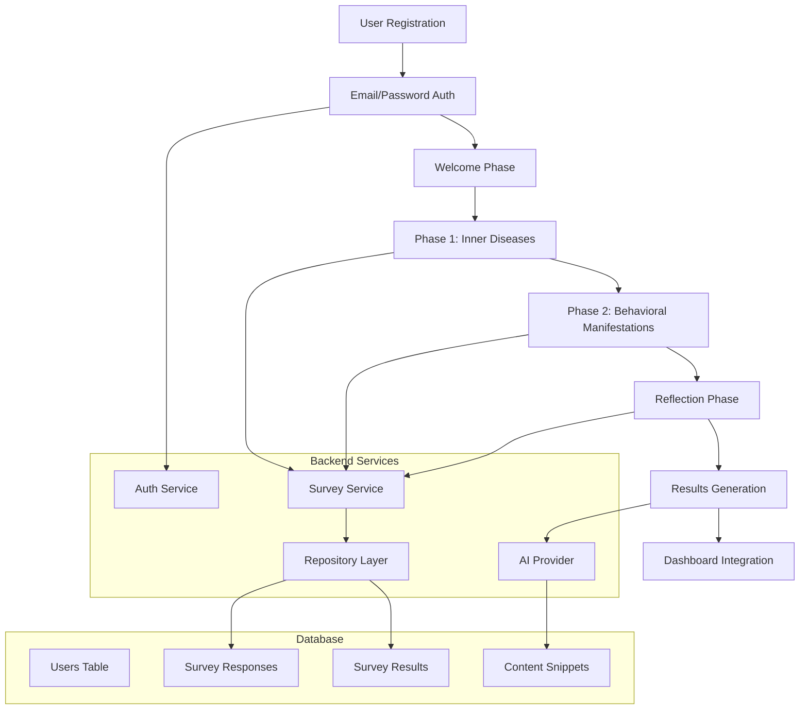

# Design Document

## Overview

The Tazkiyah Onboarding System replaces the current Supabase magic link authentication with a streamlined email/password signup flow that includes a comprehensive spiritual self-assessment survey. The system follows the existing Clean Architecture patterns established in the Sakinah application, integrating with the current AI provider system, centralized error handling, and repository patterns. The onboarding flow guides users through a 4-phase structured survey that collects minimal PII while providing personalized spiritual development recommendations.

## Architecture

### High-Level Architecture



### Clean Architecture Layers

The system follows the established Clean Architecture pattern:

1. **Domain Layer**: Survey entities, value objects, and interfaces
2. **Application Layer**: Survey use cases and business logic
3. **Infrastructure Layer**: Database repositories, AI providers, authentication
4. **Routes Layer**: Express.js endpoints following existing patterns

## Components and Interfaces

### Frontend Components (Next.js App Router)

#### Core Survey Components

```typescript
// Survey Progress Component
interface ProgressIndicatorProps {
  currentPhase: number;
  totalPhases: number;
  percentage: number;
}

// Reusable Question Card Component
interface QuestionCardProps {
  number: number;
  titleEn: string;
  titleAr: string;
  questionEn: string;
  questionAr: string;
  value: number;
  onChange: (value: number) => void;
  note?: string;
  onNoteChange: (note: string) => void;
  language: 'en' | 'ar';
}

// Likert Scale Component
interface LikertScaleProps {
  value: number;
  onChange: (value: number) => void;
  labels?: { [key: number]: string };
  disabled?: boolean;
}

// Navigation Component
interface NavigationButtonsProps {
  onBack?: () => void;
  onNext: () => void;
  nextLabel?: string;
  nextDisabled?: boolean;
  showBack?: boolean;
}
```

#### Page Components

```typescript
// apps/ui/app/auth/signup/page.tsx (Modified)
export default function SignupPage() {
  // Replace magic link with email/password
  // Add first name and gender fields to signup form
  // Gender as dropdown selection (Male/Female)
  // Redirect to welcome phase after successful registration
}

// apps/ui/app/onboarding/welcome/page.tsx
export default function WelcomePage() {
  // Survey introduction focusing on Tazkiyah and habit plans
  // No language selection - simplified welcome phase
}

// apps/ui/app/onboarding/phase1/page.tsx
export default function Phase1Page() {
  // 4 questions: envy, arrogance, self-deception, lust
}

// apps/ui/app/onboarding/phase2/page.tsx
export default function Phase2Page() {
  // 7 questions: anger, malice, backbiting, etc.
}

// apps/ui/app/onboarding/reflection/page.tsx
export default function ReflectionPage() {
  // Open response questions
  // Show simplified AI preview: personalized habit todo list and takhlya/ta7lya fields
}

// apps/ui/app/onboarding/results/page.tsx
export default function ResultsPage() {
  // Radar chart and recommendations
}
```

### Backend API Design

#### Survey API Endpoints

```typescript
// apps/api/src/routes/v1/onboarding.ts
router.post('/welcome', authMiddleware, welcomeHandler);
router.post('/phase1', authMiddleware, validateBody(Phase1Schema), phase1Handler);
router.post('/phase2', authMiddleware, validateBody(Phase2Schema), phase2Handler);
router.post('/reflection', authMiddleware, validateBody(ReflectionSchema), reflectionHandler);
router.get('/results/:surveyId', authMiddleware, resultsHandler);
router.get('/progress', authMiddleware, progressHandler);
```

#### Authentication API Updates

```typescript
// apps/api/src/routes/v1/auth.ts (Modified)
router.post('/register', validateBody(SignupSchema), registerHandler);
// SignupSchema includes: email, password, firstName, gender
// Remove magic link endpoints
```

### Domain Entities and Value Objects

```typescript
// apps/api/src/domain/entities/SurveyResponse.ts
export class SurveyResponse {
  constructor(
    public readonly id: SurveyResponseId,
    public readonly userId: UserId,
    public readonly phaseNumber: number,
    public readonly questions: QuestionResponse[],
    public readonly completedAt: Date,
    public readonly language: Language
  ) {}
}

// apps/api/src/domain/entities/SurveyResult.ts
export class SurveyResult {
  constructor(
    public readonly id: SurveyResultId,
    public readonly userId: UserId,
    public readonly diseaseScores: DiseaseScore[],
    public readonly reflectionAnswers: ReflectionAnswer[],
    public readonly recommendations: Recommendation[],
    public readonly generatedAt: Date
  ) {}
}

// apps/api/src/domain/value-objects/QuestionResponse.ts
export class QuestionResponse {
  constructor(
    public readonly questionId: string,
    public readonly score: LikertScore, // 1-5
    public readonly note?: string
  ) {}
}
```

### Repository Interfaces

```typescript
// apps/api/src/domain/repositories/ISurveyRepository.ts
export interface ISurveyRepository {
  saveSurveyResponse(response: SurveyResponse): Promise<Result<SurveyResponse>>;
  getSurveyProgress(userId: UserId): Promise<Result<SurveyProgress>>;
  getSurveyResult(userId: UserId): Promise<Result<SurveyResult>>;
  saveSurveyResult(result: SurveyResult): Promise<Result<SurveyResult>>;
}

// apps/api/src/domain/repositories/IUserRepository.ts (Extended)
export interface IUserRepository {
  createWithEmailPassword(email: string, password: string, profile: UserProfile): Promise<Result<User>>;
  // Existing methods...
}
```

## Data Models

### Database Schema Extensions

```sql
-- New tables for survey system
CREATE TABLE survey_responses (
    id UUID PRIMARY KEY DEFAULT gen_random_uuid(),
    user_id UUID NOT NULL REFERENCES users(id),
    phase_number INTEGER NOT NULL CHECK (phase_number BETWEEN 1 AND 3),
    question_id VARCHAR(50) NOT NULL,
    score INTEGER NOT NULL CHECK (score BETWEEN 1 AND 5),
    note TEXT,
    completed_at TIMESTAMP WITH TIME ZONE DEFAULT NOW(),
    created_at TIMESTAMP WITH TIME ZONE DEFAULT NOW(),

    UNIQUE(user_id, phase_number, question_id)
);

CREATE TABLE survey_results (
    id UUID PRIMARY KEY DEFAULT gen_random_uuid(),
    user_id UUID NOT NULL REFERENCES users(id) UNIQUE,
    disease_scores JSONB NOT NULL, -- {envy: 4, arrogance: 2, ...}
    critical_diseases JSONB NOT NULL, -- List of diseases with scores 4-5 for Tazkiyah plan
    reflection_answers JSONB NOT NULL, -- {strongestStruggle: "...", dailyHabit: "..."}
    personalized_habits JSONB NOT NULL, -- Auto-generated habit todo list based on survey
    tazkiyah_plan JSONB NOT NULL, -- Spiritual development plan for critical diseases
    radar_chart_data JSONB, -- Chart visualization data
    generated_at TIMESTAMP WITH TIME ZONE DEFAULT NOW(),
    updated_at TIMESTAMP WITH TIME ZONE DEFAULT NOW()
);

CREATE TABLE survey_progress (
    user_id UUID PRIMARY KEY REFERENCES users(id),
    current_phase INTEGER NOT NULL DEFAULT 0 CHECK (current_phase BETWEEN 0 AND 4),
    started_at TIMESTAMP WITH TIME ZONE DEFAULT NOW(),
    last_updated TIMESTAMP WITH TIME ZONE DEFAULT NOW()
);

-- Update users table for minimal PII (collected during signup)
ALTER TABLE users
ADD COLUMN first_name VARCHAR(100),
ADD COLUMN gender VARCHAR(20) CHECK (gender IN ('male', 'female'));

-- Remove or deprecate magic link columns if they exist
-- ALTER TABLE users DROP COLUMN IF EXISTS magic_link_token;
```

### TypeScript Type Definitions

```typescript
// packages/types/src/survey.ts
export interface SignupRequest {
  email: string;
  password: string;
  firstName: string;
  gender: 'male' | 'female';
}

export interface Phase1Request {
  envyScore: LikertScore;
  envyNote?: string;
  arroganceScore: LikertScore;
  arroganceNote?: string;
  selfDeceptionScore: LikertScore;
  selfDeceptionNote?: string;
  lustScore: LikertScore;
  lustNote?: string;
}

export interface Phase2Request {
  angerScore: LikertScore;
  angerNote?: string;
  maliceScore: LikertScore;
  maliceNote?: string;
  backbitingScore: LikertScore;
  backbitingNote?: string;
  suspicionScore: LikertScore;
  suspicionNote?: string;
  loveOfDunyaScore: LikertScore;
  loveOfDunyaNote?: string;
  lazinessScore: LikertScore;
  lazinessNote?: string;
  despairScore: LikertScore;
  despairNote?: string;
}

export interface ReflectionRequest {
  strongestStruggle: string; // min: 10, max: 500
  dailyHabit: string; // min: 10, max: 500
}

export interface ReflectionPreview {
  personalizedHabits: string[]; // Simple todo list for preview
  takhliyahFocus: string[]; // Critical diseases to remove
  tahliyahFocus: string[]; // Virtues to cultivate
}

export interface SurveyResults {
  diseaseScores: Record<Disease, LikertScore>;
  categorizedDiseases: {
    critical: Disease[]; // scores 4-5 - becomes foundation of Tazkiyah plan
    moderate: Disease[]; // score 3
    strengths: Disease[]; // scores 1-2
  };
  personalizedHabits: PersonalizedHabit[]; // Auto-generated todo list based on survey results
  tazkiyahPlan: TazkiyahPlan; // Structured plan focusing on critical heart diseases
  radarChartData: ChartData;
  exportOptions: ExportOption[];
}

export interface PersonalizedHabit {
  id: string;
  title: string;
  description: string;
  frequency: 'daily' | 'weekly' | 'bi-weekly';
  targetDisease: Disease;
  difficultyLevel: 'easy' | 'moderate' | 'challenging';
  estimatedDuration: string; // "5 minutes", "15 minutes", etc.
  islamicContent: ContentSnippet[]; // Supporting verses, hadith, duas
}

export interface TazkiyahPlan {
  criticalDiseases: Disease[]; // Primary focus areas (scores 4-5)
  planType: 'takhliyah'; // Purification plan for removing negative traits
  phases: TazkiyahPhase[]; // Structured progression plan
  expectedDuration: string; // "3 months", "6 months"
  milestones: PlanMilestone[];
}

export interface TazkiyahPhase {
  phaseNumber: number;
  title: string;
  description: string;
  targetDiseases: Disease[];
  duration: string;
  practices: Practice[];
  checkpoints: string[];
}

export interface Practice {
  name: string;
  type: 'dhikr' | 'dua' | 'reflection' | 'behavioral' | 'study';
  description: string;
  frequency: string;
  islamicBasis: ContentSnippet[];
}

export type LikertScore = 1 | 2 | 3 | 4 | 5;
export type Gender = 'male' | 'female';
export type Disease = 'envy' | 'arrogance' | 'selfDeception' | 'lust' | 'anger' | 'malice' | 'backbiting' | 'suspicion' | 'loveOfDunya' | 'laziness' | 'despair';
```

## Error Handling

### Survey-Specific Error Codes

```typescript
// apps/api/src/shared/errors.ts (Extended)
export enum SurveyErrorCode {
  SURVEY_NOT_FOUND = 'SURVEY_NOT_FOUND',
  INVALID_PHASE_PROGRESSION = 'INVALID_PHASE_PROGRESSION',
  SURVEY_ALREADY_COMPLETED = 'SURVEY_ALREADY_COMPLETED',
  INVALID_LIKERT_SCORE = 'INVALID_LIKERT_SCORE',
  REFLECTION_TOO_SHORT = 'REFLECTION_TOO_SHORT',
  REFLECTION_TOO_LONG = 'REFLECTION_TOO_LONG',
  RESULTS_GENERATION_FAILED = 'RESULTS_GENERATION_FAILED'
}
```

### Error Handling Patterns

```typescript
// Follow existing patterns from apps/api/src/routes/v1/ai.ts
try {
  const result = await surveyUseCase.execute(request);

  if (Result.isError(result)) {
    requestLogger.error('Survey operation failed', { error: result.error });
    const { response, status, headers } = handleExpressError(
      createAppError(SurveyErrorCode.SURVEY_NOT_FOUND, result.error.message),
      traceId
    );
    res.status(status).set(headers).json(response);
    return;
  }

  const successResponse = createSuccessResponse(result.value, traceId);
  res.json(successResponse);
} catch (error) {
  requestLogger.error('Unexpected survey error', { error });
  const { response, status, headers } = handleExpressError(error, traceId);
  res.status(status).set(headers).json(response);
}
```

## Testing Strategy

### Unit Testing

```typescript
// apps/api/src/__tests__/domain/entities/SurveyResponse.test.ts
describe('SurveyResponse', () => {
  it('should create valid survey response with likert scores');
  it('should validate score ranges 1-5');
  it('should handle optional notes');
});

// apps/api/src/__tests__/application/usecases/SubmitPhase1UseCase.test.ts
describe('SubmitPhase1UseCase', () => {
  it('should save phase 1 responses successfully');
  it('should update survey progress');
  it('should handle validation errors');
});
```

### Integration Testing

```typescript
// apps/api/src/__tests__/integration/survey-flow.test.ts
describe('Survey Flow Integration', () => {
  it('should complete full survey flow from phase 1 to results');
  it('should prevent phase skipping');
  it('should handle survey resumption');
});
```

### End-to-End Testing

```typescript
// tests/onboarding-flow.spec.ts
test('complete onboarding survey flow', async ({ page }) => {
  await page.goto('/auth/signup');

  // Test email/password signup
  await page.fill('[name="email"]', 'test@example.com');
  await page.fill('[name="password"]', 'securePassword123');
  await page.click('button[type="submit"]');

  // Test survey progression
  await expect(page).toHaveURL('/onboarding/welcome');
  await page.selectOption('[name="language"]', 'en');
  await page.click('text=Continue');

  // Test Phase 1
  await expect(page).toHaveURL('/onboarding/phase1');
  await page.click('[data-testid="envy-score-3"]');
  // ... continue through all phases

  // Test Results
  await expect(page).toHaveURL('/onboarding/results');
  await expect(page.locator('[data-testid="radar-chart"]')).toBeVisible();
});
```

### Visual Design Testing

```typescript
// apps/ui/__tests__/visual/onboarding-visual.test.tsx
describe('Onboarding Visual Design', () => {
  it('should render Islamic design elements correctly');
  it('should support RTL layout for Arabic');
  it('should display smooth animations');
  it('should be responsive across devices');
});
```

## Integration Points

### AI Provider Integration

```typescript
// apps/api/src/infrastructure/ai/providers/SurveyAiProvider.ts
export class SurveyAiProvider {
  async generatePersonalizedHabits(
    diseaseScores: Record<Disease, LikertScore>,
    reflectionAnswers: ReflectionAnswer[]
  ): Promise<PersonalizedHabit[]> {
    // Generate auto-generated habit todo list based on:
    // 1. High-scoring diseases (4-5) get priority habits
    // 2. Reflection answers influence habit customization
    // 3. Islamic content snippets matched to each habit
  }

  async generateTazkiyahPlan(
    criticalDiseases: Disease[],
    userProfile: UserProfile
  ): Promise<TazkiyahPlan> {
    // Create structured spiritual development plan focused on:
    // 1. Critical heart diseases identified (scores 4-5)
    // 2. Multi-phase takhliyah (purification) approach
    // 3. Progressive practices with Islamic basis
    // 4. Measurable milestones and checkpoints
  }
}
```

### Existing System Integration

1. **Authentication System**: Replace magic link with email/password using existing Supabase auth patterns
2. **Content System**: Integrate with existing `content_snippets` table for Islamic content in personalized habits and Tazkiyah plan
3. **Habit System**: Auto-generate personalized habit todo list that feeds directly into existing habit tracking system
4. **Tazkiyah Plan System**: Critical diseases (scores 4-5) become the foundation for structured spiritual development plans
5. **Dashboard**: Display two-part results - personalized habits as actionable todos and Tazkiyah plan as long-term spiritual development roadmap
6. **Logging**: Use existing `logger.info/error` patterns with traceId
7. **Error Handling**: Use existing `createSuccessResponse/createAppError` utilities

### State Management

```typescript
// apps/ui/lib/survey-state.ts
interface SurveyState {
  currentPhase: number;
  language: Language;
  responses: {
    phase1?: Phase1Request;
    phase2?: Phase2Request;
    reflection?: ReflectionRequest;
  };
  progress: number;
}

// Use localStorage for auto-save functionality
export class SurveyStateManager {
  private static STORAGE_KEY = 'sakinah_survey_state';

  static save(state: SurveyState): void {
    localStorage.setItem(this.STORAGE_KEY, JSON.stringify(state));
  }

  static load(): SurveyState | null {
    const stored = localStorage.getItem(this.STORAGE_KEY);
    return stored ? JSON.parse(stored) : null;
  }

  static clear(): void {
    localStorage.removeItem(this.STORAGE_KEY);
  }
}
```

### Route Protection and Progress Tracking

```typescript
// apps/ui/middleware.ts (Extended)
export function middleware(request: NextRequest) {
  // Check survey completion status
  // Redirect to appropriate phase based on progress
  // Prevent phase skipping
}
```

This design maintains consistency with the existing Sakinah architecture while introducing the comprehensive survey system that collects minimal PII and provides personalized spiritual development guidance through the established AI and content recommendation systems.