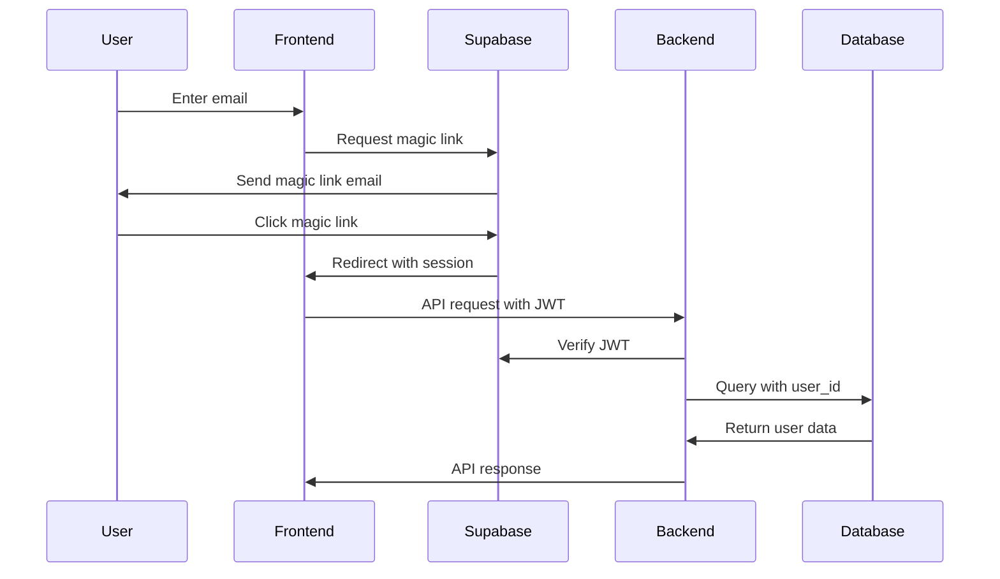

# 🔐 Authentication System

## Overview

Sakinah uses Supabase Auth for authentication with a privacy-first, passwordless approach aligned with Islamic values of simplicity and security.

## Authentication Philosophy

### Islamic Principles

- **Simplicity (Basāṭah)**: No complex password requirements
- **Privacy (Sitr)**: Minimal data collection
- **Trust (Amānah)**: Secure handling of user credentials
- **Accessibility**: Easy for all Muslims regardless of technical skill

### Technical Principles

- **Passwordless**: Magic link authentication only
- **JWT-based**: Stateless authentication
- **Row Level Security**: Database-level privacy enforcement
- **Optional profiles**: Users control what information they share

## Authentication Flow



## Implementation Details

### Frontend Authentication (`apps/web/lib/`)

#### Supabase Client Setup

```typescript
// lib/supabase-browser.ts
import { createClientComponentClient } from '@supabase/auth-helpers-nextjs'
import type { Database } from '@sakinah/types'

export const supabase = createClientComponentClient<Database>()

// lib/supabase-server.ts
import { createServerComponentClient } from '@supabase/auth-helpers-nextjs'
import { cookies } from 'next/headers'
import type { Database } from '@sakinah/types'

export const createServerSupabaseClient = () => {
  return createServerComponentClient<Database>({ cookies })
}
```

#### Authentication Hooks

```typescript
// lib/auth-context.tsx
'use client'

import { createContext, useContext, useEffect, useState } from 'react'
import { User } from '@supabase/auth-helpers-nextjs'
import { supabase } from './supabase-browser'

interface AuthContextType {
  user: User | null
  loading: boolean
  signOut: () => Promise<void>
}

const AuthContext = createContext<AuthContextType>({
  user: null,
  loading: true,
  signOut: async () => {}
})

export function AuthProvider({ children }: { children: React.ReactNode }) {
  const [user, setUser] = useState<User | null>(null)
  const [loading, setLoading] = useState(true)

  useEffect(() => {
    const getSession = async () => {
      const { data: { session } } = await supabase.auth.getSession()
      setUser(session?.user || null)
      setLoading(false)
    }

    getSession()

    const { data: { subscription } } = supabase.auth.onAuthStateChange(
      async (event, session) => {
        setUser(session?.user || null)
        setLoading(false)
      }
    )

    return () => subscription.unsubscribe()
  }, [])

  const signOut = async () => {
    await supabase.auth.signOut()
    setUser(null)
  }

  return (
    <AuthContext.Provider value={{ user, loading, signOut }}>
      {children}
    </AuthContext.Provider>
  )
}

export const useAuth = () => {
  const context = useContext(AuthContext)
  if (!context) {
    throw new Error('useAuth must be used within AuthProvider')
  }
  return context
}
```

#### Magic Link Authentication

```typescript
// app/auth/page.tsx
'use client'

import { useState } from 'react'
import { supabase } from '@/lib/supabase-browser'

export default function AuthPage() {
  const [email, setEmail] = useState('')
  const [loading, setLoading] = useState(false)
  const [message, setMessage] = useState('')

  const handleSignIn = async (e: React.FormEvent) => {
    e.preventDefault()
    setLoading(true)
    setMessage('')

    const { error } = await supabase.auth.signInWithOtp({
      email,
      options: {
        emailRedirectTo: `${window.location.origin}/auth/callback`
      }
    })

    if (error) {
      setMessage(error.message)
    } else {
      setMessage('Check your email for the login link!')
    }

    setLoading(false)
  }

  return (
    <div className="max-w-md mx-auto mt-8">
      <h1 className="text-2xl font-bold mb-6">Welcome to Sakinah</h1>
      <p className="mb-4 text-gray-600">
        Sign in with your email to begin your spiritual journey
      </p>

      <form onSubmit={handleSignIn} className="space-y-4">
        <div>
          <label htmlFor="email" className="block text-sm font-medium">
            Email Address
          </label>
          <input
            id="email"
            type="email"
            value={email}
            onChange={(e) => setEmail(e.target.value)}
            required
            className="mt-1 block w-full border-gray-300 rounded-md shadow-sm"
            placeholder="your@email.com"
          />
        </div>

        <button
          type="submit"
          disabled={loading}
          className="w-full py-2 px-4 bg-green-600 text-white rounded-md hover:bg-green-700 disabled:opacity-50"
        >
          {loading ? 'Sending link...' : 'Send magic link'}
        </button>
      </form>

      {message && (
        <p className={`mt-4 text-sm ${
          message.includes('Check your email') ? 'text-green-600' : 'text-red-600'
        }`}>
          {message}
        </p>
      )}
    </div>
  )
}
```

#### Auth Callback Handler

```typescript
// app/auth/callback/route.ts
import { createServerSupabaseClient } from '@/lib/supabase-server'
import { NextRequest, NextResponse } from 'next/server'

export async function GET(request: NextRequest) {
  const requestUrl = new URL(request.url)
  const code = requestUrl.searchParams.get('code')

  if (code) {
    const supabase = createServerSupabaseClient()
    await supabase.auth.exchangeCodeForSession(code)
  }

  // Redirect to dashboard after successful auth
  return NextResponse.redirect(`${requestUrl.origin}/dashboard`)
}
```

### Backend Authentication (`apps/api/src/`)

#### JWT Middleware

```typescript
// infrastructure/auth/jwt-middleware.ts
import jwt from 'jsonwebtoken'
import type { Request, Response, NextFunction } from 'express'
import { AuthError } from '../../shared/errors'

interface AuthenticatedRequest extends Request {
  user?: {
    id: string
    email?: string
  }
}

export function authenticateJWT(
  req: AuthenticatedRequest,
  res: Response,
  next: NextFunction
) {
  const authHeader = req.headers.authorization
  const token = authHeader && authHeader.split(' ')[1] // Bearer TOKEN

  if (!token) {
    return res.status(401).json({
      error: 'Access token required',
      code: 'NO_TOKEN'
    })
  }

  try {
    const jwtSecret = process.env.SUPABASE_JWT_SECRET
    if (!jwtSecret) {
      throw new Error('JWT secret not configured')
    }

    const decoded = jwt.verify(token, jwtSecret) as any

    // Extract user ID from JWT payload
    req.user = {
      id: decoded.sub,
      email: decoded.email
    }

    next()
  } catch (error) {
    console.error('JWT verification failed:', error)
    return res.status(403).json({
      error: 'Invalid or expired token',
      code: 'INVALID_TOKEN'
    })
  }
}
```

#### User Context

```typescript
// shared/auth-context.ts
export interface AuthenticatedUser {
  id: string
  email?: string
}

export interface RequestContext {
  user: AuthenticatedUser
  // Add other context as needed
}

// Helper to extract user from request
export function getUserFromRequest(req: any): AuthenticatedUser {
  if (!req.user) {
    throw new AuthError('User not authenticated')
  }
  return req.user
}
```

#### Route Protection

```typescript
// routes/protected-example.ts
import { Router } from 'express'
import { authenticateJWT } from '../infrastructure/auth/jwt-middleware'
import { getUserFromRequest } from '../shared/auth-context'

const router = Router()

// Apply authentication to all routes
router.use(authenticateJWT)

router.get('/habits', async (req, res) => {
  try {
    const user = getUserFromRequest(req)

    // User is authenticated, proceed with business logic
    const habits = await habitRepo.getByUserId(user.id)

    res.json({ habits })
  } catch (error) {
    res.status(500).json({ error: error.message })
  }
})

export default router
```

## Database Security (Row Level Security)

### User Data Isolation

```sql
-- Enable RLS on all tables
ALTER TABLE plans ENABLE ROW LEVEL SECURITY;
ALTER TABLE habits ENABLE ROW LEVEL SECURITY;
ALTER TABLE habit_completions ENABLE ROW LEVEL SECURITY;

-- Example policy for plans table
CREATE POLICY "Users can only see their own plans" ON plans
  FOR ALL USING (auth.uid() = user_id);

-- Example policy for habits table
CREATE POLICY "Users can only see their own habits" ON habits
  FOR ALL USING (auth.uid() = user_id);

-- More restrictive policy for completions
CREATE POLICY "Users can only see their own completions" ON habit_completions
  FOR SELECT USING (auth.uid() = user_id);

CREATE POLICY "Users can only insert their own completions" ON habit_completions
  FOR INSERT WITH CHECK (auth.uid() = user_id);
```

### Profile Management

```sql
-- User profiles with privacy controls
CREATE TABLE profiles (
  id UUID PRIMARY KEY REFERENCES auth.users(id) ON DELETE CASCADE,
  display_name TEXT,
  timezone TEXT DEFAULT 'UTC',
  privacy_level INTEGER DEFAULT 1, -- 1=private, 2=circles, 3=public
  created_at TIMESTAMPTZ DEFAULT NOW(),
  updated_at TIMESTAMPTZ DEFAULT NOW()
);

-- RLS for profiles
CREATE POLICY "Users can view own profile" ON profiles
  FOR ALL USING (auth.uid() = id);

-- Trigger to create profile on user signup
CREATE OR REPLACE FUNCTION handle_new_user()
RETURNS trigger AS $$
BEGIN
  INSERT INTO profiles (id, display_name, timezone)
  VALUES (NEW.id, NEW.email, 'UTC');
  RETURN NEW;
END;
$$ LANGUAGE plpgsql SECURITY DEFINER;

CREATE TRIGGER on_auth_user_created
  AFTER INSERT ON auth.users
  FOR EACH ROW EXECUTE FUNCTION handle_new_user();
```

## Privacy Controls

### Data Minimization

```typescript
// Only collect essential user information
interface UserProfile {
  id: string
  displayName?: string  // Optional
  timezone: string      // For prayer times, etc.
  createdAt: string
  // No email, location, or other PII stored
}

// API responses exclude sensitive data
function sanitizeUser(user: any): PublicUserData {
  return {
    id: user.id,
    displayName: user.displayName || 'Anonymous Muslim',
    // Email and other sensitive data excluded
  }
}
```

### Anonymous Mode

```typescript
// Allow users to participate anonymously in circles
interface CircleSettings {
  isAnonymous: boolean
  // If true, member names are hidden
}

function getCircleMembers(circleId: string, isAnonymous: boolean) {
  if (isAnonymous) {
    return members.map(member => ({
      id: member.id,
      displayName: 'Anonymous Muslim',
      // Hide all identifying information
    }))
  }
  return members
}
```

## Session Management

### Session Configuration

```typescript
// Supabase Auth configuration
const authConfig = {
  // Session duration
  sessionRefreshThreshold: 24 * 60 * 60, // 24 hours

  // Auto-refresh configuration
  autoRefreshToken: true,

  // Secure cookie settings
  cookieOptions: {
    name: 'sb-auth-token',
    lifetime: 7 * 24 * 60 * 60, // 1 week
    domain: process.env.COOKIE_DOMAIN,
    sameSite: 'lax',
    secure: process.env.NODE_ENV === 'production'
  }
}
```

### Logout Handling

```typescript
// Complete session cleanup
async function signOut() {
  // Clear Supabase session
  await supabase.auth.signOut()

  // Clear any local storage
  localStorage.removeItem('user-preferences')
  sessionStorage.clear()

  // Clear any cached API data
  queryClient.clear()

  // Redirect to home page
  router.push('/')
}
```

## Security Features

### CSRF Protection

```typescript
// CSRF middleware for state-changing operations
import csrf from 'csurf'

const csrfProtection = csrf({
  cookie: {
    httpOnly: true,
    secure: process.env.NODE_ENV === 'production',
    sameSite: 'strict'
  }
})

// Apply to POST/PUT/DELETE routes
app.use('/api/', csrfProtection)
```

### Rate Limiting

```typescript
// Prevent brute force attacks
import rateLimit from 'express-rate-limit'

const authLimiter = rateLimit({
  windowMs: 15 * 60 * 1000, // 15 minutes
  max: 5, // 5 attempts per window
  message: {
    error: 'Too many authentication attempts, please try again later',
    code: 'RATE_LIMIT_EXCEEDED'
  },
  standardHeaders: true,
  legacyHeaders: false
})

app.use('/api/auth/', authLimiter)
```

### Input Validation

```typescript
// Validate all authentication inputs
import { z } from 'zod'

const emailSchema = z.string().email().max(254)

function validateAuthInput(email: string) {
  try {
    return emailSchema.parse(email)
  } catch (error) {
    throw new ValidationError('Invalid email format')
  }
}
```

## Error Handling

### Authentication Errors

```typescript
// Standardized auth error responses
export class AuthError extends Error {
  constructor(
    message: string,
    public code: string = 'AUTH_ERROR',
    public statusCode: number = 401
  ) {
    super(message)
    this.name = 'AuthError'
  }
}

// Error handling middleware
function handleAuthError(error: Error, req: Request, res: Response, next: NextFunction) {
  if (error instanceof AuthError) {
    return res.status(error.statusCode).json({
      error: error.message,
      code: error.code
    })
  }
  next(error)
}
```

### User-Friendly Messages

```typescript
// Map technical errors to user-friendly messages
const errorMessages = {
  'INVALID_TOKEN': 'Your session has expired. Please sign in again.',
  'NO_TOKEN': 'Please sign in to continue.',
  'RATE_LIMIT_EXCEEDED': 'Too many attempts. Please wait before trying again.',
  'EMAIL_NOT_CONFIRMED': 'Please check your email and click the confirmation link.',
}

function getUserFriendlyError(code: string): string {
  return errorMessages[code] || 'An error occurred. Please try again.'
}
```

## Testing Authentication

### Test User Setup

```typescript
// Create test users for development
async function createTestUser() {
  const testEmail = 'test@sakinah.local'

  const { data, error } = await supabaseAdmin.auth.admin.createUser({
    email: testEmail,
    password: 'test-password-123',
    email_confirm: true
  })

  if (error) throw error
  return data.user
}
```

### Authentication Tests

```typescript
// Test authentication middleware
describe('JWT Middleware', () => {
  it('should reject requests without token', async () => {
    const req = mockRequest()
    const res = mockResponse()

    authenticateJWT(req, res, jest.fn())

    expect(res.status).toHaveBeenCalledWith(401)
    expect(res.json).toHaveBeenCalledWith({
      error: 'Access token required',
      code: 'NO_TOKEN'
    })
  })

  it('should accept valid JWT token', async () => {
    const token = jwt.sign({ sub: 'user-id' }, process.env.SUPABASE_JWT_SECRET!)
    const req = mockRequest({
      headers: { authorization: `Bearer ${token}` }
    })
    const res = mockResponse()
    const next = jest.fn()

    authenticateJWT(req, res, next)

    expect(req.user).toEqual({ id: 'user-id' })
    expect(next).toHaveBeenCalled()
  })
})
```

## Monitoring and Analytics

### Authentication Metrics

```typescript
// Track authentication events (privacy-compliant)
function trackAuthEvent(event: 'login' | 'logout' | 'failed_login') {
  // Only track aggregated, non-personally-identifiable metrics
  analytics.track({
    event: `auth_${event}`,
    properties: {
      timestamp: new Date().toISOString(),
      // No user ID or email tracked
    }
  })
}
```

### Security Monitoring

```typescript
// Monitor for suspicious activity
function detectSuspiciousActivity(req: Request) {
  const indicators = {
    tooManyFailedAttempts: req.rateLimitInfo?.remaining === 0,
    unusualUserAgent: !req.get('User-Agent')?.includes('Mozilla'),
    invalidTokenFormat: req.headers.authorization?.split(' ').length !== 2
  }

  if (Object.values(indicators).some(Boolean)) {
    logger.warn('Suspicious authentication activity detected', {
      ip: req.ip,
      indicators: Object.entries(indicators).filter(([_, v]) => v).map(([k, _]) => k)
    })
  }
}
```

---

This authentication system balances security with Islamic values of simplicity and privacy, ensuring users can safely engage in their spiritual journey without compromising their personal information.